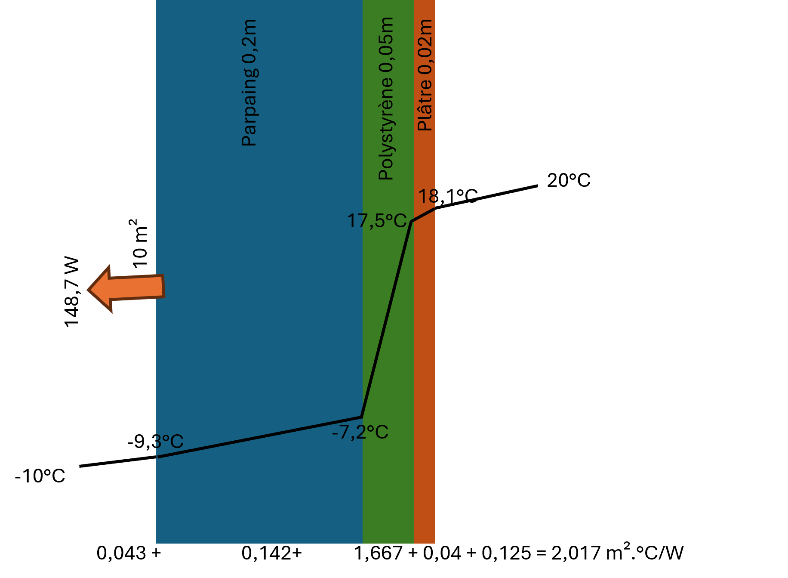

1.2. Heat Transfer in Composite Walls
===============================================

The image below shows an example of a composite wall used for heat transfer simulation:

Example of heat transfer simulation in a composite wall:

.. code-block:: python

    from HeatTransfer import CompositeWall

    # Create a composite wall with external and internal convection coefficients
    wall = CompositeWall.Object(he=23, hi=8, Ti=20, Te=-10, A=10)

    # Add layers to the wall using material names
    wall.add_layer(thickness=0.20, material='Parpaings creux')  # Hollow concrete blocks
    wall.add_layer(thickness=0.05, material='Polystyrène')  # Polystyrene
    wall.add_layer(thickness=0.02, material='Plâtre')  # Plaster

    # Calculationate heat transfer and temperatures at each layer interface
    wall.calculate()
    wall.df
    print(f"df = {wall.df}")
    print(f"R_total = {wall.R_total} m².°C/W")

Expected result:

.. list-table::
   :header-rows: 1

   * - Thickness (m)
     - Material
     - Conductivity (W/m.°C)
     - Resistance (m².°C/W)
     - Entry Temperature (°C)
     - Exit Temperature (°C)
     - Q (W)
     - A (m²)
   * - NaN
     - Outdoor air
     - NaN
     - 0.043478
     - -10.000000
     - -9.353644
     - 148.661889
     - 10
   * - 0.20
     - Hollow concrete blocks
     - 1.40
     - 0.142857
     - -9.353644
     - -7.229903
     - 148.661889
     - 10
   * - 0.05
     - Polystyrene
     - 0.03
     - 1.666667
     - -7.229903
     - 17.547079
     - 148.661889
     - 10
   * - 0.02
     - Plaster
     - 0.50
     - 0.040000
     - 17.547079
     - 18.141726
     - 148.661889
     - 10
   * - NaN
     - Indoor air
     - NaN
     - 0.125000
     - 18.141726
     - 20.000000
     - 148.661889
     - 10

List of Available Materials
-------------------------------

.. list-table::
   :header-rows: 1

   * - Anglais
     - Français
     - Conductivité thermique (W/m.°C)
   * - Glass wool
     - Laine de verre
     - 0.034
   * - Expanded cork agglomerated with pitch
     - Liège expansé aggloméré au brai
     - 0.048
   * - Pure expanded cork
     - Liège expansé pur
     - 0.043
   * - Hollow concrete blocks
     - Parpaings creux
     - 1.4
   * - Hard limestone (marble)
     - Pierre calcaire dure (marbre)
     - 2.9
   * - Soft limestone
     - Pierre calcaire tendre
     - 0.95
   * - Granite
     - Pierre granit
     - 3.5
   * - Expanded polystyrene
     - Polystyrène expansé
     - 0.047
   * - Polystyrene
     - Polystyrène
     - 0.03
   * - Extruded polystyrene
     - Polystyrène extrudé
     - 0.035
   * - Polyurethane foam
     - Mousse de polyuréthane
     - 0.03
   * - Plaster
     - Plâtre
     - 0.5
   * - Glass
     - Verre
     - 1.0
   * - Air
     - Air
     - None

Explanation of the Equations Used
-----------------------------------

The composite wall heat transfer model uses the following equations to calculate total thermal resistance, heat flux, and temperatures at layer interfaces:

1. **Convective thermal resistance**:
   - External resistance: 
     .. math::
       R_e = \frac{1}{h_e}
       
   - Internal resistance: 
     .. math::
       R_i = \frac{1}{h_i}

2. **Thermal resistance of layers**:
   - For each layer, thermal resistance is calculated as follows:
     .. math::
       R_{\text{layer}} = \frac{\text{thickness}}{\text{conductivity}}

3. **Total thermal resistance**:
   - The total thermal resistance of the composite wall is the sum of convective resistances and layer resistances:
     .. math::
       R_{\text{total}} = R_e + R_i + \sum R_{\text{layers}}

4. **Heat transfer coefficient**:
   - The heat transfer coefficient is the inverse of total thermal resistance:
     .. math::
       U = \frac{1}{R_{\text{total}}}

5. **Heat flux**:
   - Heat flux through the composite wall is calculated using Fourier's law:
     .. math::
       Q = U \cdot A \cdot (T_i - T_e)
   where \( A \) is the wall surface area, \( T_i \) is the indoor temperature, and \( T_e \) is the outdoor temperature.

6. **Temperatures at layer interfaces**:
   - The external wall temperature after convective resistance is calculated as follows:
     .. math::
       T_{\text{external wall}} = T_e + \frac{Q \cdot R_e}{A}
   - Les temperatures aux interfaces des couches sont ensuite calculées en utilisant le flux thermique et les résistances thermiques :
     .. math::
       T_{\text{interface}} = T_{\text{précédente}} + \frac{Q \cdot R_{\text{couche}}}{A}

Ces équations allow to déterminer la distribution de temperature à travers le mur composite et le flux thermique total traversant le mur.