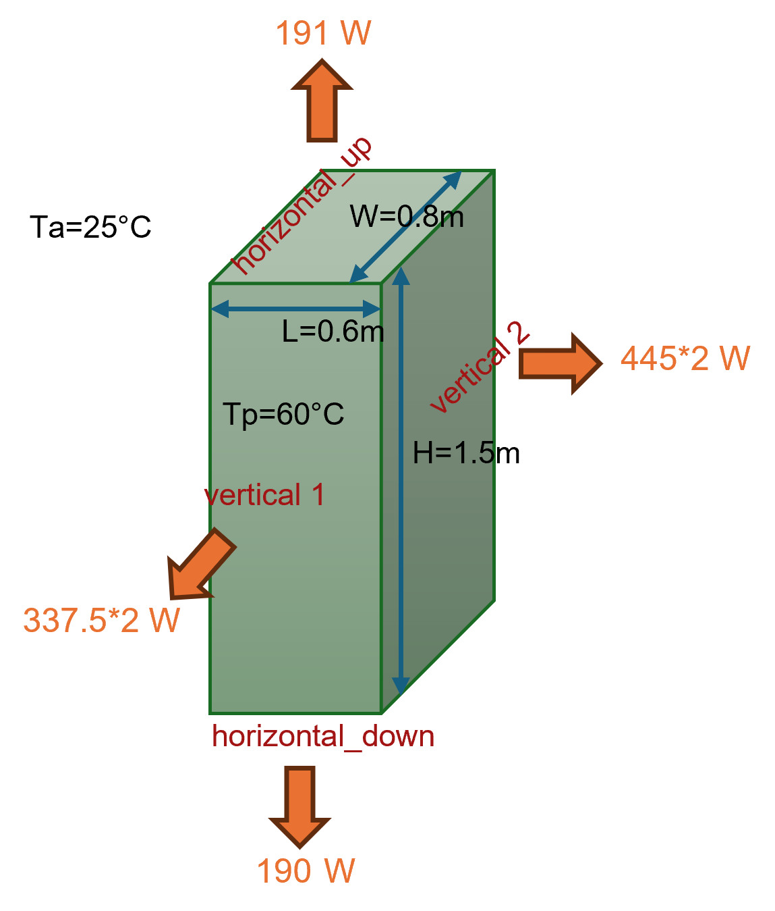

Corps parallélépipédique
========================

Usage
-----------

.. code-block:: python

  from HeatTransfer import ParallelepipedicBody

  # Définir la configuration thermique de chaque face
  thermal_measurements = {
      'top': {'Tp': 60.0, 'isolated': False},
      'bottom': {'Tp': 60.0, 'isolated': False},
      'front': {'Tp': 60.0, 'isolated': False},
      'back': {'Tp': 60.0, 'isolated': False},
      'left': {'Tp': 60.0, 'isolated': False},
      'right': {'Tp': 60.0, 'isolated': False}
  }

  # Créer l'objet
  objet = ParallelepipedicBody.Object(
      L=0.6,  # Longueur [m]
      W=0.8,  # Largeur [m]
      H=1.5,  # Hauteur [m]
      Ta=25,  # Température ambiante [°C]
      faces_config=thermal_measurements
  )
  
  # Calculer les transferts
  objet.calculate()

  # Afficher les résultats
  print(f"Transfert total: {objet.get_total_heat_transfer():.2f} W")
  print(objet.df)

Results ::

  Transfer total: 1956.56 W
       Face        Orientation  Surface (m²) Tp (°C)  Ta (°C) ΔT (°C) Isolated  Heat Transfer (W)  Heat Flux (W/m²)
  0     top    Horizontal (up)          0.48    60.0       25    35.0    False             191.19            398.31
  1  bottom  Horizontal (down)          0.48    60.0       25    35.0    False             189.98            395.80
  2   front           Vertical          1.20    60.0       25    35.0    False             450.11            375.09
  3    back           Vertical          1.20    60.0       25    35.0    False             450.11            375.09
  4    left           Vertical          0.90    60.0       25    35.0    False             337.58            375.09
  5   right           Vertical          0.90    60.0       25    35.0    False             337.58            375.09
  6   TOTAL                  -          5.16       -       25       -        -            1956.56            379.18

The calculation retourne :

- **Transfer thermique total** : Somme des pertes by toutes les faces [W]
- **DataFrame détaillé** : Pour chaque face (top, bottom, front, back, left, right)
  
  - Surface [m²]
  - Temperature de wall [°C]
  - Coefficient de convection [W/m²·K]
  - Transfer by convection [W]
  - Transfer by rayonnement [W]
  - Transfer total by face [W]

Possible Parameters
--------------------

**Configuration des faces** (dictionnaire ``faces_config``) :

Each face can have :

- ``'Tp'`` : Temperature de wall [°C]
- ``'isolated'`` : ``True`` ou ``False`` (face isolée ou non)

**Faces disponibles** : ``'top'``, ``'bottom'``, ``'front'``, ``'back'``, ``'left'``, ``'right'``

Explication du model
----------------------

Ce model calculates le transfert thermique d'un parallelepiped body (rectangular box) to l'ambient environment. 

The calculation prend en compte :

1. **Convection naturelle** : Échange thermique between la surface et l'air ambiant
2. **Rayonnement** : Émission de chaleur by radiation to l'environnement

Pour chaque face, le model :

- Calculated la surface d'échange
- Détermine le coefficient de convection according to l'orientation (horizontale/verticale)
- Calculated les flux de convection et de rayonnement
- Somme les contributions for obtenir le transfert total
