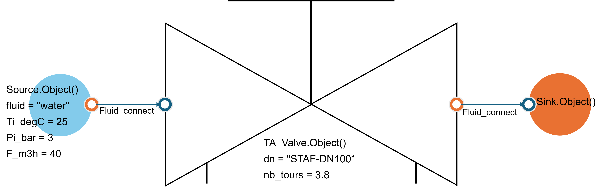
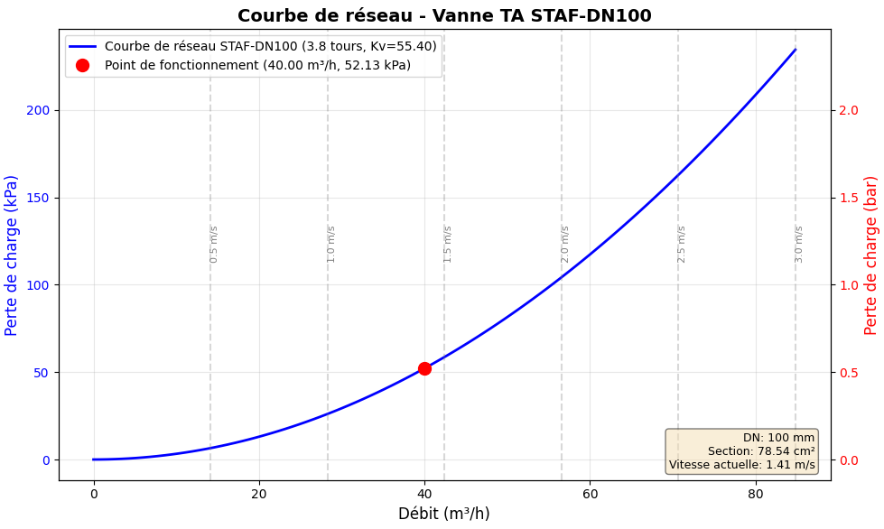

.. _ta_valve:

Vanne d'équilibrage TA (Tour & Andersson / IMI Hydronic)
=========================================================

Les vannes d'équilibrage **TA** (Tour & Andersson / IMI Hydronic Engineering) allowstent l'équilibrage hydraulique des circuits CVC for garantir les flow rates nominaux et optimizesr la performance energy des installations.

This Python class calculates pressure drops through different TA valve models using the manufacturer's **official IMI TA Kv data** as a function of the number of opening turns.

Usage
-----------

.. code-block:: python

    from ThermodynamicCycles.Hydraulic import TA_Valve
    from ThermodynamicCycles.Source import Source
    from ThermodynamicCycles.Sink import Sink
    from ThermodynamicCycles.Connect import Fluid_connect

    # Configuration de la source d'eau
    SOURCE = Source.Object()
    SOURCE.Ti_degC = 25           # Température d'entrée : 25°C
    SOURCE.Pi_bar = 3.0           # Pression d'entrée : 3 bar
    SOURCE.fluid = "Water"        # Fluide : eau
    SOURCE.F_m3h = 40             # Débit : 40 m³/h
    SOURCE.calculate()

    # Configuration de la vanne STAF-DN100
    VALVE = TA_Valve.Object()
    VALVE.dn = "STAF-DN100"       # Type : STAF-DN100 (bride fonte, PN 16/25)
    VALVE.nb_tours = 3.8          # Ouverture : 3.8 tours (interpolation auto)
    Fluid_connect(VALVE.Inlet, SOURCE.Outlet)
    VALVE.calculate()

    # Configuration du puits (sink)
    SINK = Sink.Object()
    Fluid_connect(SINK.Inlet, VALVE.Outlet)
    SINK.Po_bar = 2.0
    SINK.calculate()

    # Affichage des résultats
    print(VALVE.df)
    VALVE.Plot()

.. note::
   Le **Puits (Sink)** impose sa pressure de output (2.0 bar = 200000 Pa) à la vanne. 
   La pressure d'input de la vanne est donc **recalculated automatiquement** as a function of la pressure drop :
   
   P_input = P_output + ΔP = 200000 Pa + 52131.53 Pa = 252131.53 Pa

Results ::

                             
  Flow rate (m3/h)                      40.0
  Number de tours                    3.8
  Diameter nominal (DN)       STAF-DN100
  Kv                                55.4
  Pressure d'input (Pa)   252131.527845
  Loss de charge (Pa)      52131.527845
  Pressure de output (Pa)       200000.0

**Courbe de network de la vanne :**

Possible Parameters
--------------------

**Types de vannes TA disponibles**

The class ``TA_Valve`` supporte **plus de 100 références** de vannes d'équilibrage IMI TA :

.. list-table:: **Types de vannes TA et références disponibles**
   :header-rows: 1
   :widths: 25 20 55

   * - **Série**
     - **Plage DN**
     - **Application typique**
   * - **STAD**
     - DN10-50
     - Réseaux secondaires filetés (PN 25)
   * - **STAV**
     - DN15-50
     - Réseaux secondaires Venturi économiques (PN 20)
   * - **TBV / TBV-C**
     - DN10-20
     - Unités terminales : radiateurs, ventilo-convecteurs (PN 20)
   * - **STAF**
     - DN20-400
     - Réseaux primaires fonte à brides (PN 16/25)
   * - **STAF-SG**
     - DN65-400
     - Grands networkx fonte GS haute résistance (PN 16/25)
   * - **STAG**
     - DN65-300
     - Installation rapide with raccords rainurés Victaulic (PN 16)
   * - **STA**
     - DN15-150
     - Anciennes installations (maintenance)
   * - **STAP / STAM**
     - DN15-100
     - Régulateurs ΔP for équilibrage dynamique
   * - **MDFO**
     - DN20-900
     - Orifices fixes de mesure (Kv fixe)

.. note::
   Le paramètre ``dn`` can be spécifié under forme de **chaîne** (ex: "DN65", "STAF-DN100") ou d'**entier** (ex: 65).

**Configuration Parameters**

.. list-table::
   :header-rows: 1
   :widths: 20 60 20

   * - Paramètre
     - Description
     - Unité
   * - **nb_tours**
     - Number de tours d'ouverture de la vanne (0 for régulateurs/orifices fixes)
     - tours
   * - **dn**
     - Diameter nominal ou référence de la vanne (chaîne ou entier)
     - -
   * - **q**
     - Flow rate volumique calculé à partir du flow rate massique
     - m³/h
   * - **Kv**
     - Coefficient de flow rate according to tables IMI TA (interpolé si nécessaire)
     - m³/h
   * - **delta_P**
     - Loss de charge à travers la vanne
     - Pa
   * - **rho**
     - Masse volumique of the fluid (calculated via CoolProp)
     - kg/m³
   * - **Ti_degC**
     - Temperature d'input
     - °C
   * - **Pi_bar**
     - Pressure d'input
     - bar
   * - **F_m3h**
     - Flow rate volumique
     - m³/h
   * - **F_kgs**
     - Flow rate massique
     - kg/s
   * - **Inlet**
     - Port d'input of the fluid
     - FluidPort
   * - **Outlet**
     - Port de output of the fluid
     - FluidPort

.. note::
   Les propriétés thermodynamiques of the fluid (densité, viscosité) sont calculateds automatiquement via **CoolProp** as a function of la temperature et de la pressure.

**Conseils de sélection :**

1. **Réseaux primaires (> DN50)** : Préférer STAF, STAF-SG ou STAG
2. **Réseaux secondaires (DN15-50)** : Utiliser STAD ou STAV
3. **Unités terminales** : Choisir TBV ou TBV-C
4. **Équilibrage automatique** : Utiliser STAP ou STAM
5. **Orifices de mesure** : MDFO for mesure TA-Scope

**Dimensionnement :**

- Calculatedr le flow rate nominal du circuit
- Sélectionner le DN for une pressure drop between **3 et 15 kPa** au flow rate nominal
- Vérifier la plage de réglage disponible (nombre de tours)
- Prévoir une marge for les ajustements futurs

.. warning::
   - Ne pas dépasser les limites de temperature of the fluid (typiquement -20°C à +120°C)
   - Respecter les pressures nominales PN 16/20/25 according to les models
   - Vérifier la compatibilité fluid/matériau (eau glycolée, etc.)
   - Pour régulateurs (STAP, STAM, STAZ) et orifices fixes (MDFO), utiliser **nb_tours = 0**

Explication du model
---------------------

**Principe du coefficient Kv**

Le coefficient Kv représente le **flow rate d'eau en m³/h** traversant la vanne with une pressure drop de **1 bar** à 15-20°C. Plus le Kv est élevé, plus la vanne laisse passer de flow rate for une pressure drop donnée.

**Équations de calcul**

**1. Flow rate volumique à partir du flow rate massique :**

.. math::

  Q = \frac{\dot{m} \cdot 3600}{\rho}

Où :

- **Q** : Flow rate volumique (m³/h)
- **ṁ** : Flow rate massique (kg/s)
- **ρ** : Masse volumique of the fluid (kg/m³)

**2. Loss de charge en fonction du Kv :**

.. math::

  \Delta P = \left(\frac{Q}{K_v}\right)^2 \cdot 10^5

Où :

- **ΔP** : Loss de charge (Pa)
- **Q** : Flow rate volumique (m³/h)
- **Kv** : Coefficient de flow rate for l'ouverture donnée (m³/h)
- **10⁵** : Facteur de conversion (1 bar = 10⁵ Pa)

**Example de calcul :**

Pour Q = 70 m³/h et Kv = 81.4 m³/h :

.. math::

  \Delta P = \left(\frac{70}{81.4}\right)^2 \cdot 10^5 = (0.860)^2 \cdot 10^5 = 73960 \text{ Pa}

**3. Interpolation du Kv :**

Si le nombre de tours ne correspond pas exactement à une valeur tabulée, une **interpolation linéaire** est effectuée :

.. math::

  K_v = K_{v,inf} + \frac{(K_{v,sup} - K_{v,inf}) \cdot (n_{tours} - n_{inf})}{(n_{sup} - n_{inf})}

**Example d'interpolation :**

Pour une vanne STAF-DN100 with 4.3 tours (entre 4 tours et 4.5 tours) :

- Kv(4 tours) = 66 m³/h
- Kv(4.5 tours) = 91.7 m³/h
- Interpolation : Kv(4.3) = 66 + (91.7-66) × (4.3-4)/(4.5-4) = 66 + 25.7 × 0.6 = 81.4 m³/h

**4. Conservation des propriétés thermodynamiques :**

À travers la vanne (transformation isenthalpique) :

- **Flow rate massique conservé :** :math:`\dot{m}_{output} = \dot{m}_{input}`
- **Temperature conservée :** :math:`T_{output} = T_{input}`
- **Pressure réduite :** :math:`P_{output} = P_{input} - \Delta P`

Sources des data et références
----------------------------------

Les data Kv useds proviennent de la **documentation technique officielle IMI TA** :

**Sources documentaires :**

- **STAD_PN25_FR_FR_low.pdf** : Tables Kv for vannes STAD DN10-50
- **STAF_STAF-SG_EN_MAIN.pdf** : Tables Kv for vannes STAF et STAF-SG DN20-400
- Catalogues techniques IMI Hydronic Engineering
- Fiches produits TA-Scope (MDFO, STAP, STAM)

**Certification et conformité :**

- Valeurs Kv certifiées according to **EN 1267** (Robinetterie industrielle)
- Normes **PN 16**, **PN 20**, **PN 25** according to les models
- Compatible with systems de mesure **TA-Scope** et **TA-Surveyor**

**Documentation complémentaire :**

- Site officiel : `https://www.imi-hydronic.com <https://www.imi-hydronic.com>`_
- Logiciel : TA-Designer (dimensionnement de networkx hydrauliques)
- Formation : Équilibrage hydraulique et usage du TA-Scope
