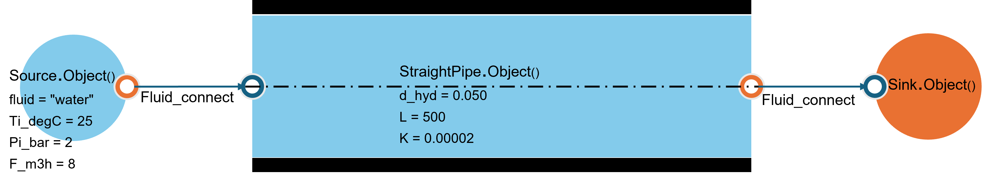

.. _straight_pipe:

4.1. Linear pressure drop in a water pipe
==========================================

4.1.1. Usage Example of "StraightPipe"
---------------------------------------

The image below shows an example of a pipe with the source and the sink:

The following code shows how to use the "StraightPipe" class to calculate the linear pressure drop in a water pipe:

.. code-block:: python

    from ThermodynamicCycles.Hydraulic import StraightPipe
    from ThermodynamicCycles.Source import Source
    from ThermodynamicCycles.Sink import Sink
    from ThermodynamicCycles.Connect import Fluid_connect

    SOURCE = Source.Object()
    STRAIGHT_PIPE = StraightPipe.Object()
    STRAIGHT_PIPE2 = StraightPipe.Object()
    SINK = Sink.Object()

    SOURCE.fluid = "water"
    SOURCE.Ti_degC = 25
    SOURCE.Pi_bar = 2
    SOURCE.F_m3h = 8
    SOURCE.calculate()

    STRAIGHT_PIPE.d_hyd = 0.050
    STRAIGHT_PIPE.L = 500
    STRAIGHT_PIPE.K = 0.00002

    Fluid_connect(STRAIGHT_PIPE.Inlet, SOURCE.Outlet)
    STRAIGHT_PIPE.calculate()
    Fluid_connect(SINK.Inlet, STRAIGHT_PIPE.Outlet)
    SINK.calculate()

    print(SOURCE.df)
    print(STRAIGHT_PIPE.df)
    print(SINK.df)

Results:
--------

Source
------
.. list-table::
   :header-rows: 1

   * - Timestamp
     - 2025-02-23 17:32:30
   * - fluid
     - water
   * - Ti_degC
     - 25.0
   * - Pi_bar
     - 2
   * - F_Sm3h
     - 8.0
   * - F_Nm3h
     - None
   * - F_m3h
     - 8.0
   * - F_kgh
     - 7976.737
   * - F_kgs
     - 2.216
   * - F_m3s
     - 0.002
   * - F_Sm3s
     - 0.002

StraightPipe
------------
.. list-table::
   :header-rows: 1

   * - Timestamp
     - None
   * - fluid
     - water
   * - Ti_degC
     - 25.0
   * - Inlet.F (kg/s)
     - 2.216
   * - Inlet.h (j/kg)
     - 105011.0
   * - Outlet.h (j/kg)
     - 105011.0
   * - A (m2)
     - 0.002
   * - V (m/s)
     - 1.132
   * - Re
     - 63397.0
   * - delta_P(Pa)
     - 136626.9

Sink
----
.. list-table::
   :header-rows: 1

   * - Timestamp
     - 2025-02-23 17:32:30
   * - fluid
     - water
   * - F_kgs
     - 2.216
   * - Inlet.P(Pa)
     - 336626.9
   * - Inlet.h(J/kg)
     - 105011.0
   * - H(W)
     - 232680.0
   * - fluid_quality
     - liquid
   * - Q
     - -0.220011
   * - D (kg/m3)
     - 997.2
   * - F_Sm3h
     - 8.0
   * - F_m3h
     - 8.0
   * - F_kgh
     - 7977.0

Nomenclature
------------
.. list-table::
   :header-rows: 1

   * - Parameter
     - Description
     - Unité
   * - Ti_degC
     - Temperature inlet in degrees Celsius
     - °C
   * - Pi_bar
     - Pressure inlet in bars
     - bar
   * - F_Sm3h
     - Flow rate standard volumetric in cubic meters per hour
     - m³/h
   * - F_Nm3h
     - Flow rate normal volumetric in cubic meters per hour
     - m³/h
   * - F_m3h
     - Flow rate volumetric in cubic meters per hour
     - m³/h
   * - F_kgh
     - Flow rate mass in kilograms per hour
     - kg/h
   * - F_kgs
     - Flow rate mass in kilograms per second
     - kg/s
   * - F_m3s
     - Flow rate volumetric in cubic meters per second
     - m³/s
   * - F_Sm3s
     - Flow rate standard volumetric in cubic meters per second
     - m³/s
   * - Inlet.F
     - Flow rate mass flow at inlet in kilograms per second
     - kg/s
   * - Inlet.h
     - Enthalpy at inlet in joules per kilogram
     - J/kg
   * - Outlet.h
     - Enthalpy at outlet in joules per kilogram
     - J/kg
   * - A
     - Section of the tube in square meters
     - m²
   * - V
     - Speed flow in meters per second
     - m/s
   * - Re
     - Number Reynolds number
     - -
   * - delta_P
     - Loss pressure in pascals
     - Pa
   * - Inlet.P
     - Pressure at inlet in pascals
     - Pa
   * - H
     - Power in watts
     - W
   * - fluid_quality
     - Quality of the fluid
     - -
   * - Q
     - Flow rate thermique
     - -
   * - D
     - Density in kilograms per cubic meter
     - kg/m³
   * - Ti
     - Temperature inlet in Kelvin
     - K
   * - To
     - Temperature outlet in Kelvin
     - K
   * - roughness
     - Roughness of the surface
     - m
   * - d_hyd
     - Diameter hydraulic in meters
     - m
   * - L
     - Length in meters
     - m
   * - K
     - Roughness in meters
     - m
   * - alpha
     - Angle of tube inclination in radians
     - rad
   * - delta_Z
     - Height du tuyau in meters
     - m
   * - delta_H
     - Loss de pressure in meters
     - m
   * - eta
     - Viscosity dynamique of the fluid
     - Pa·s
   * - rho
     - Density of the fluid
     - kg/m³
   * - delta_P
     - Loss pressure loss due to friction
     - Pa
   * - diff_P
     - Difference pressure difference between inlet and outlet
     - Pa
   * - m_flow
     - Flow rate mass in kilograms per second
     - kg/s
   * - perimeter
     - Périmètre
     - m
   * - A
     - Section of the tube in square meters
     - m²
   * - V
     - Speed flow in meters per second
     - m/s
   * - Re
     - Number Reynolds number
     - -
   * - h
     - Enthalpy in joules per kilogram
     - J/kg