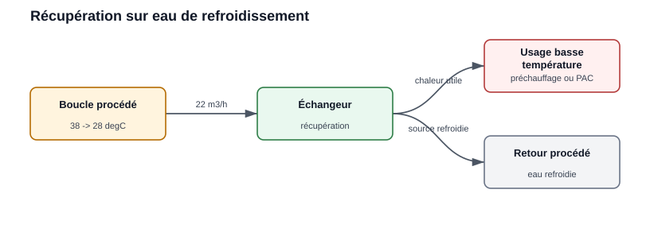
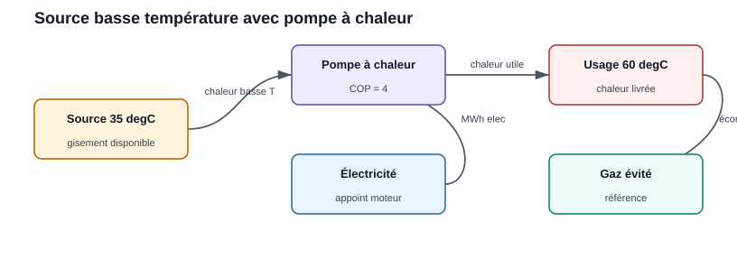
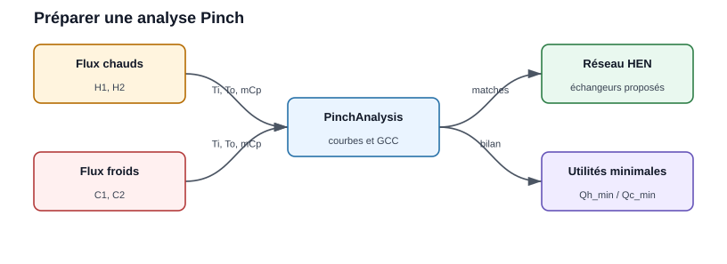
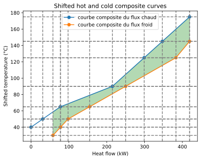
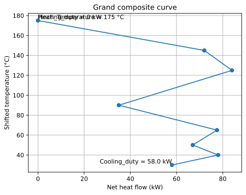

Examples utilisateur
====================

Example 1 : récupération on eau de refroidissement
---------------------------------------------------

Une boucle d'eau sort d'un procédé à ``38 degC`` et can be refroidie jusqu'à
``28 degC`` before retour. Le flow rate est de ``22 m3/h`` et le site fonctionne
``6 500 h/an``.

   La source basse temperature est séparée de l'usage by un échangeur.

.. code-block:: python

   debit_m3_h = 22
   rho = 1000
   cp = 4.18
   t_source = 38
   t_retour = 28
   heures = 6500

   debit_kg_s = debit_m3_h * rho / 3600
   puissance_kw = debit_kg_s * cp * (t_source - t_retour)
   energie_mwh = puissance_kw * heures / 1000

   print(f"Puissance récupérable : {puissance_kw:.1f} kW")
   print(f"Energie annuelle : {energie_mwh:.0f} MWh/an")

Result attendu :

.. list-table::
   :widths: 45 30 25
   :header-rows: 1

   * - Indicateur
     - Valeur
     - Unité
   * - Power récupérable
     - 255,4
     - kW
   * - Energy annuelle récupérable
     - 1 660
     - MWh/an

Lecture for l'utilisateur :

* le gisement est basse temperature ;
* il peut alimenter un préchauffage ou l'évaporateur d'une pompe à chaleur ;
* la valeur dépend fortement de la simultanéité with le besoin.

.. note:: **Valorisation en CEE**

   La heat recovery on un compresseur d'air (ou tout autre rejet
   thermique) can be valorisée en Energy Savings Certificates via la
   fiche ``IND-UT-103``. The ESC calculation is handled in the dedicated chapter :
   voir :doc:`../011-cee/module_cee` (« Example 3 : heat recovery sur
   compresseur d'air »).

Example 2 : comparer récupération directe et pompe à chaleur
------------------------------------------------------------

Une source à ``35 degC`` ne peut pas alimenter directement un usage à
``60 degC``. On compare alors la récupération directe utilisable à basse
temperature with une pompe à chaleur.

   La pompe à chaleur relève le niveau de temperature au prix d'une
   consumption électrique.

.. code-block:: python

   puissance_source_kw = 180
   heures = 5000
   cop_pac = 4.0
   prix_elec_eur_mwh = 120
   prix_gaz_eur_mwh = 55

   chaleur_livree_mwh = puissance_source_kw * heures / 1000
   electricite_pac_mwh = chaleur_livree_mwh / cop_pac
   gaz_evite_mwh = chaleur_livree_mwh

   cout_pac = electricite_pac_mwh * prix_elec_eur_mwh
   gain_gaz = gaz_evite_mwh * prix_gaz_eur_mwh
   gain_net = gain_gaz - cout_pac

   print(f"Chaleur livrée : {chaleur_livree_mwh:.0f} MWh/an")
   print(f"Electricité PAC : {electricite_pac_mwh:.0f} MWh/an")
   print(f"Gain net énergie : {gain_net:.0f} EUR/an")

Result attendu :

.. list-table::
   :widths: 45 30 25
   :header-rows: 1

   * - Indicateur
     - Valeur
     - Unité
   * - Chaleur livrée
     - 900
     - MWh/an
   * - Électricité PAC
     - 225
     - MWh/an
   * - Coût électrique
     - 27 000
     - EUR/an
   * - Gaz évité
     - 49 500
     - EUR/an
   * - Gain net energy
     - 22 500
     - EUR/an

Interprétation :

* si le gain net est négatif, la pompe à chaleur n'est pas pertinente with ces
  hypothèses de prix ;
* si le gaz évité est cher ou carboné, l'intérêt augmente ;
* le COP real doit être recalculé with les temperatures source et usage.

Example 3 : préparer une analyse Pinch
--------------------------------------

Lorsque plusieurs hot and cold streams existent, l'analyse Pinch allows
d'identifier la récupération maximale théorique before de dessiner les
échangeurs.

   Les hot and cold streams alimentent l'analyse, qui fournit les utilités
   minimales et les appariements d'échange.

.. code-block:: python

   import pandas as pd
   from PinchAnalysis import PinchAnalysis

   # Les colonnes 'id' et 'name' sont requises par PinchAnalysis.Object
   df = pd.DataFrame({
       "id": [1, 2, 3, 4],
       "name": ["H1", "H2", "C1", "C2"],
       "Ti": [180, 95, 25, 45],
       "To": [70, 45, 120, 140],
       "mCp": [2.4, 3.1, 2.0, 1.8],
       "dTmin2": [5, 5, 5, 5],
       "integration": [True, True, True, True],
   })

   pinch = PinchAnalysis.Object(df)

   print(f"Pincement : {pinch.Pinch_Temperature} degC")       # 175
   print(f"Utilité chaude minimale : {pinch.Heating_duty} kW")  # 0
   print(f"Utilité froide minimale : {pinch.Cooling_duty} kW")  # 58.0
   print(f"Chaleur récupérée : {pinch.heat_recovery} kW")      # 361.0

   pinch.plot_composites_curves()
   pinch.plot_GCC()

Results reals :

.. list-table::
   :widths: 40 40 20
   :header-rows: 1

   * - Indicateur
     - Attribut (valeur)
     - Unité
   * - Point de pincement
     - ``pinch.Pinch_Temperature`` (= 175)
     - degC
   * - Utilité chaude minimale
     - ``pinch.Heating_duty`` (= 0)
     - kW
   * - Utilité froide minimale
     - ``pinch.Cooling_duty`` (= 58,0)
     - kW
   * - Chaleur récupérée
     - ``pinch.heat_recovery`` (= 361,0)
     - kW

Ici l'utilité chaude minimale est **nulle** : les flux chauds fournissent, par
intégration, la totalité du besoin de chauffe ; seule une utilité froide de
58 kW reste nécessaire, for 361 kW récupérés.

Plots générés by l'example (real outputs are shown) :

   ``pinch.plot_composites_curves()`` : composites chaude et froide en
   temperatures décalées ; le recouvrement = 361 kW récupérables.

   ``pinch.plot_GCC()`` : la grande courbe composite touche l'axe au pincement
   (175 °C) et montre l'utilité froide résiduelle (58 kW) en bas.

Ce cas est à utiliser quand l'utilisateur veut passer d'un simple inventaire à
une stratégie d'intégration thermique complète.
