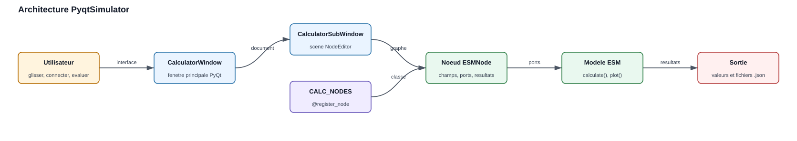
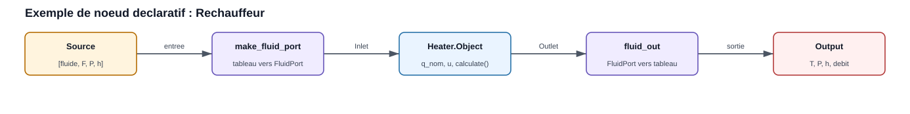
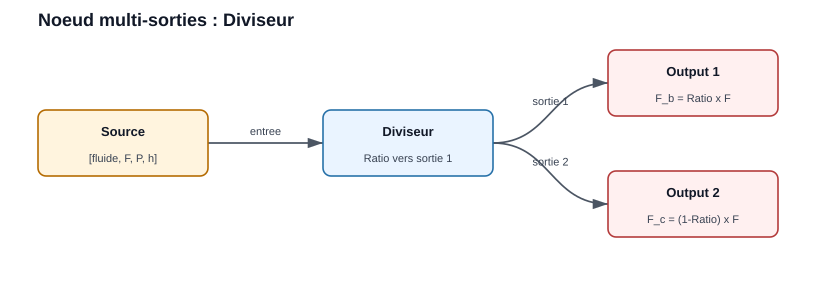
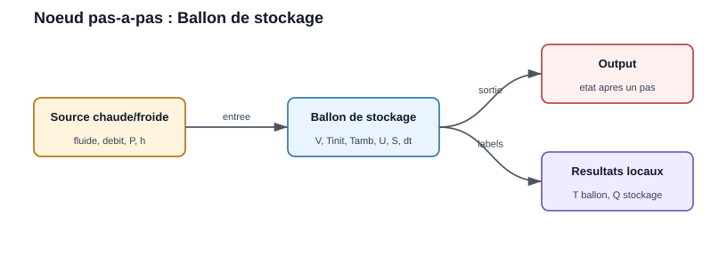
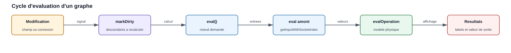

.. _gui_tools:

Graphical Interfaces and Visual Tools
=======================================

EnergySystemModels contient plusieurs briques visuelles for construire,
tester et présenter des models energy. Cette page sert de guide de
travail : elle explique comment lancer le simulateur PyQt, comment lire un
graphe, comment ajouter un nouveau node et comment documenter les results
avec les figures réellement produites by la bibliothèque.

Overview
--------------

Le simulateur graphique principal est ``PyqtSimulator``. Il s'appuie on le
moteur ``NodeEditor`` for manipuler des nodes et des connexions, then appelle
les models physiques de la bibliothèque : compresseur, échangeur, pompe,
batterie, humidificateur, réchauffeur, etc.

   Architecture générale : la fenêtre PyQt héberge une scène NodeEditor, les
   nodes enregistrés appellent les models EnergySystemModels, then les valeurs
   sont affichées ou sauvegardées.

Le principe d'usage est toujours le même :

1. Lancer l'interface.
2. Créer une nouvelle scène.
3. Glisser des nodes from la palette.
4. Relier les outputs aux inputs.
5. Renseigner les paramètres.
6. Évaluer le graphe ou le node de output.
7. Sauvegarder le projet au format ``.json``.

Installation and Launch
-------------------------

Les interfaces nécessitent ``PyQt5``. Dans un environnement de développement,
installer aussi la bibliothèque en mode éditable ou ajouter le dossier ``src``
au ``PYTHONPATH``.

.. code-block:: console

   pip install -e .
   pip install PyQt5

Dethen le dépôt source :

.. code-block:: powershell

   cd A:\OneDrive\_Github_\EnergySystemModels
   $env:PYTHONPATH = "$PWD\src"
   python -m PyqtSimulator.main

Le script crée une ``QApplication``, applique le style ``Fusion`` then ouvre
``CalculatorWindow``. La fenêtre contient une zone MDI et une palette de nodes.
Chaque élément de la palette vient du registre ``CALC_NODES``.

PyqtSimulator Interface
-----------------------

La fenêtre principale regroupe les éléments suivants :

``Nodes``
   Palette latérale. Elle liste les classes enregistrées par
   ``@register_node(...)``. Un glisser-déposer crée un node in la scène.

``Zone de travail``
   Scène NodeEditor. Les nodes y sont placés, déplacés et connectés.

``Menu fichier``
   Création, ouverture et sauvegarde des graphes. Les projets sont stockés en
   JSON by le moteur NodeEditor.

``Menu contextuel``
   Clic droit on un node for l'évaluer, le marquer invalide ou forcer le
   recalcul de ses descendants. Clic droit on une connexion for choisir le
   type de courbe.

``Node Output``
   Node d'affichage final. Il déclenche l'évaluation amont et présente le
   fluid, le flow rate, la pressure, l'enthalpy, la temperature et le flow rate
   volumique.

Port Convention
--------------------

Les connexions échangent des listes Python courtes. Cette convention rend les
graphes faciles à sérialiser in les fichiers ``.json``.

.. list-table::
   :header-rows: 1

   * - Type de flux
     - Format échangé
     - Unités
   * - Fluid thermodynamique
     - ``[fluid, F, P, h]``
     - ``fluid`` en chaîne, ``F`` en kg/s, ``P`` en bar, ``h`` en kJ/kg
   * - Air humide
     - ``[w, F, P, h]``
     - ``w`` en g/kg d'air sec, ``F`` en kg/s, ``P`` en bar, ``h`` en kJ/kg

Les helpers de ``PyqtSimulator.nodes.esm_node_helpers`` assurent la conversion
entre ces listes et les objets de la bibliothèque :

``make_fluid_port(arr)``
   Convertit ``[fluid, F, P, h]`` to un ``FluidPort``.

``fluid_out(port)``
   Convertit un ``FluidPort`` de output to la liste standard.

``make_air_port(arr)`` et ``air_out(port)``
   Appliquent la même logique aux ports d'air humide.

Reading a Graph
-------------------

Pour un graphe simple ``Source -> Heater -> Output`` :

   Le node source fournit le fluid. Le réchauffeur convertit la liste d'input
   en ``FluidPort``, appelle le model ``Heater.Object`` then renvoie une liste
   de output compatible with ``Output``.

Example d'usage :

1. Ajouter un node ``Source``.
2. Choisir le fluid, by example ``Water`` ou ``R134a``.
3. Définir le flow rate, la temperature et la pressure.
4. Ajouter un node ``Heater``.
5. Renseigner ``Power nominale`` et ``Taux de charge``.
6. Ajouter un node ``Output``.
7. Relier ``Source`` to ``Heater``, then ``Heater`` vers
   ``Output``.
8. Évaluer ``Output``.

Result attendu : ``Output`` affiche l'état de output, tandis que le node
``Heater`` affiche directement la power transférée et la temperature
de output.

Graphs with Multiple Outputs
------------------------------

Certains composants possèdent plusieurs outputs physiques. C'est le cas du
``Splitter``, du ``Séparateur liq/vap`` et du ``Ballon de flash``. Dans ces
cas, le node renvoie une liste de valeurs, une by socket de output.

   Le ``Splitter`` conserve le même fluid, la même pressure et la même
   enthalpy on les deux branches. Seul le flow rate est réparti between les deux
   outputs according to le ratio saisi.

Example d'usage du ``Splitter`` :

1. Ajouter une ``Source`` with un flow rate de ``1.0 kg/s``.
2. Ajouter un node ``Splitter``.
3. Régler ``Fraction to output 1`` à ``0.30``.
4. Ajouter deux nodes ``Output``.
5. Relier la première output du ``Splitter`` to ``Output 1``.
6. Relier la deuxième output du ``Splitter`` to ``Output 2``.
7. Évaluer les deux outputs.

Result attendu :

.. list-table::
   :header-rows: 1

   * - Branche
     - Flow rate attendu
     - Commentaire
   * - Output 1
     - ``0.30 kg/s``
     - Fraction ``Ratio`` du flow rate d'input
   * - Output 2
     - ``0.70 kg/s``
     - Fraction ``1 - Ratio`` du flow rate d'input

Le routage est assuré by ``CalcNode.getOutputValue(index)``. Pour un node à
une seule output, la valeur est directement ``[fluid, F, P, h]``. Pour un node
multiple outputs, la valeur devient ``[[fluid, F1, P, h], [fluid, F2, P, h]]`` et
l'index du socket allows choisir la bonne branche.

Storage and Step-by-Step Calculation
------------------------------------

Le node ``Storage tank`` expose le model ``MixedStorage``. Il estime la
temperature d'un ballon mélangé after un time step, à partir de la
temperature initiale, du volume, du flow rate entrant et des pertes vers
l'ambiance.

   Le node reçoit un flux entrant, calcule l'état du ballon after ``dt`` then
   renvoie un flux de output dont l'enthalpy correspond à la temperature du
   ballon.

Paramètres principaux :

.. list-table::
   :header-rows: 1

   * - Paramètre
     - Signification
     - Unité
   * - ``Volume``
     - Volume d'eau ou de fluid in le ballon
     - m³
   * - ``T° initiale``
     - Temperature du ballon au début du time step
     - °C
   * - ``T° ambiante``
     - Temperature extérieure for le calcul des pertes
     - °C
   * - ``Coeff U pertes``
     - Coefficient global de pertes thermiques
     - W/m²/K
   * - ``Surface pertes``
     - Surface d'échange to l'ambiance
     - m²
   * - ``Pas de temps``
     - Durée du calcul élémentaire
     - s

Example d'usage :

1. Créer une ``Source`` with un fluid compatible CoolProp, by example
   ``Water``.
2. Définir une temperature d'input supérieure à la temperature initiale du
   ballon for simuler une charge, ou inférieure for simuler une décharge.
3. Ajouter ``Storage tank``.
4. Renseigner ``Volume``, ``T° initiale``, ``T° ambiante`` et ``Pas de temps``.
5. Ajouter ``Output`` en output.
6. Évaluer le graphe.

Results affichés localement :

``T° ballon``
   Temperature du volume mélangé after le time step.

``Power stockage``
   Power moyenne stockée ou restituée during le time step.

Limite importante : in l'interface actuelle, le node crée une nouvelle
instance du model à chaque évaluation. Il représente donc un time step
isolé from ``T° initiale``. Pour simuler une série temporelle complète, il
faut mettre à jour ``T° initiale`` between les pas ou utiliser un script Python
qui conserve l'objet ``MixedStorage`` between deux appels à ``calculate()``.

Evaluation Cycle
------------------

Lorsqu'un paramètre est modifié, le node est marqué comme sale et ses
descendants doivent être recalculés. L'évaluation d'un node de output remonte
le graphe jusqu'aux sources, then propage les valeurs to l'aval.

   Les champs Qt déclenchent ``onInputChanged``. Le node aval demande ensuite
   l'évaluation des nodes amont, récupère leurs valeurs et appelle son model
   physique.

Les points importants for l'utilisateur sont :

1. Un node without input connectée devient invalide.
2. Une saisie numérique invalide doit être corrigée before d'obtenir un result
   fiable.
3. Le node ``Output`` est le meilleur point de contrôle : il force le calcul
   de toute la chaîne amont.
4. Les unités affichées ne sont pas toujours celles utilisées en interne. Par
   example, la pressure circule en bar in le graphe mais les models peuvent
   utiliser le pascal.

Creating a New Node
---------------------

Pour exposer un model EnergySystemModels in l'interface, utiliser de
préférence la classe ``ESMNode``. Elle évite de réécrire l'interface Qt, la
sérialisation et les labels de results.

Un node déclaratif contient :

``op_code``
   Identifiant numérique unique in ``PyqtSimulator.calc_conf``.

``op_title``
   Nom affiché in la palette.

``icon``
   Chemin de l'icône affichée in la liste.

``INPUTS`` et ``OUTPUTS``
   Sockets d'input et de output.

   Pour un composant simple, ``OUTPUTS = [1]`` suffit. Pour un composant à
   deux outputs, utiliser ``OUTPUTS = [1, 1]`` et retourner une liste de deux
   ports in le même ordre que les sockets.

   .. code-block:: python

      OUTPUTS = [1, 1]

      def evalOperation(self, input1, input2):
          ...
          self.value = [fluid_out(model.Outlet_b), fluid_out(model.Outlet_c)]
          return self.value

``FIELDS``
   Champs numériques affichés under forme de ``QLineEdit``.

``CHOICES``
   Listes déroulantes affichées under forme de ``QComboBox``.

``RESULTS``
   Labels de output mis à jour by le calcul.

``evalOperation(...)``
   Code métier : lecture des inputs, appel du model, affichage des results,
   retour de la valeur de output.

Real Example: Heater Node
~~~~~~~~~~~~~~~~~~~~~~~~~~~~~~~

Le node ``Heater`` illustre la structure recommandée.

.. code-block:: python

   from ThermodynamicCycles.Components import Heater
   from ThermodynamicCycles.FluidPort.FluidPort import Fluid_connect
   from PyqtSimulator.calc_conf import register_node, OP_NODE_HEATER
   from PyqtSimulator.nodes.esm_node_helpers import ESMNode, make_fluid_port, fluid_out

   @register_node(OP_NODE_HEATER)
   class CalcNode_Heater(ESMNode):
       icon = "icons/heating_coil.png"
       op_code = OP_NODE_HEATER
       op_title = "Réchauffeur"
       content_label_objname = "calc_node_heater"

       INPUTS = [2]
       OUTPUTS = [1]
       HEIGHT = 300

       FIELDS = [
           ("q_nom", "Puissance nominale (kW)", 100.0),
           ("u", "Taux de charge (0-1)", 1.0),
       ]
       RESULTS = [
           ("q", "Puissance transférée (kW)"),
           ("to", "T° sortie (°C)"),
       ]

       def evalOperation(self, input1, input2):
           a = make_fluid_port(input1)
           model = Heater.Object()
           Fluid_connect(model.Inlet, a)
           model.Q_flow_nominal = self.num("q_nom") * 1000.0
           model.u = self.num("u")
           model.calculate()

           self.show_result("q", "%.3f" % (model.Q_flow / 1000.0))
           self.show_result("to", "%.2f" % model.To_degC)

           self.value = fluid_out(model.Outlet)
           return self.value

Ce model donne une règle générale : les champs affichés en kW ou en bar sont
convertis in les unités attendues by le model, then reconvertis for les
ports ou les labels utilisateur.

Registering the Node in the Palette
~~~~~~~~~~~~~~~~~~~~~~~~~~~~~~~~~~~

1. Ajouter un code unique in ``PyqtSimulator.calc_conf``.
2. Décorer la classe with ``@register_node(OP_NODE_...)``.
3. Placer le fichier in ``PyqtSimulator/nodes``.
4. Vérifier que le module est importé. Le fichier ``nodes/__init__.py`` importe
   automatiquement les fichiers ``.py`` du dossier.
5. Relancer ``PyqtSimulator``. Le node doit apparaître in la palette.

Example de réservation d'opcode :

.. code-block:: python

   OP_NODE_HEATER = 280

Development Best Practices
---------------------------------

Utiliser des noms de champs explicites
   Le libellé doit contenir l'unité : ``Power nominale (kW)``,
   ``Pressure output (bar)``, ``Rendement (-)``.

Limiter la logique Qt in les nodes
   Pour les nouveaux models, préférer ``ESMNode`` et garder le code métier
   dans ``evalOperation``.

Valider les unités à chaque conversion
   Les ports internes des models utilisent souvent le pascal et le joule par
   kilogramme. Les graphes utilisent plutôt le bar et le kJ/kg.

Afficher les results utiles localement
   Un node de composant peut afficher ses indicateurs propres : power,
   rendement, temperature de output, humidité relative, COP, perte de charge.

Tester with un graphe minimal
   Avant d'intégrer un composant complexe, tester ``Source -> composant ->
   Output``. Ajouter ensuite les branches multiples.

Documenter le comportement
   Chaque nouveau node important doit avoir un example in la documentation :
   diagram du graphe, paramètres, results attendus, limites et figure si une
   method ``plot()`` existe.

Results and Figures in the Documentation
------------------------------------------

La documentation doit distinguer trois types de visuels :

``Diagram de graphe``
   Figure pédagogique montrant les nodes et les connexions. Ces diagrams sont
   générés from ``docs/source/diagrams/*.json`` par
   ``docs/generate_diagrams.py``.

``Table de results``
   Valeurs numériques issues d'un example reproductible. Les unités doivent
   être visibles in l'en-tête ou in la première colonne.

``Plot du model``
   Figure produite by une method réelle de la bibliothèque : by example
   ``ch.plot()``, ``calc.plot()`` ou ``calc.plot_detail()``. Il ne faut pas
   remplacer ces methods by un tracé manuel arbitraire lorsque le model
   fournit déjà sa propre fonction de visualisation.

Workflow recommandé for une page d'example :

1. Décrire le cas étudié et les hypothèses.
2. Afficher le diagram des nodes connectés.
3. Donner le code minimal reproductible.
4. Afficher les results in une table.
5. Afficher les plots réellement générés by les fonctions du model.
6. Ajouter une courte interprétation métier.

Generating Diagrams and Plots
-----------------------------

Dethen le dépôt ``EnergySystemModels-fr`` :

.. code-block:: powershell

   cd A:\OneDrive\_Github_\EnergySystemModels-fr
   python docs\generate_diagrams.py

Pour les plots réellement exposés by les models :

.. code-block:: powershell

   cd A:\OneDrive\_Github_\EnergySystemModels-fr
   $env:PYTHONPATH = "A:\OneDrive\_Github_\EnergySystemModels\src"
   $env:PYTHONIOENCODING = "utf-8"
   python docs\generate_model_plots.py

Le fichier ``generate_model_plots.py`` doit rester strict : il appelle les
methods de plot de la bibliothèque et sauvegarde les figures dans
``docs/source/images``. Les figures de remplacement ne sont acceptables que
pour les examples without method graphique déterministe, et elles doivent être
signalées comme telles in le script.

Building the Documentation
---------------------------

.. code-block:: powershell

   cd A:\OneDrive\_Github_\EnergySystemModels-fr
   python -m sphinx -b html docs\source docs\_build\html

Ouvrir ensuite ``docs\_build\html\gui_tools.html`` for vérifier la mise en
forme. Contrôler en particulier :

1. Les chemins ``.. figure:: images/...``.
2. Les unités in les tableaux.
3. La lisibilité des diagrams on une largeur réduite.
4. La présence des plots lorsque l'example appelle une method ``plot``.

Troubleshooting
---------------

``ModuleNotFoundError: PyqtSimulator``
   Ajouter ``EnergySystemModels/src`` au ``PYTHONPATH`` ou installer le paquet
   en mode éditable.

``QApplication`` ou ``PyQt5`` introuvable
   Installer ``PyQt5`` in l'environnement actif.

``CoolProp`` introuvable
   Installer les dépendances scientifiques utilisées by les composants
   thermodynamiques.

Un node n'apparaît pas in la palette
   Vérifier l'opcode, le décorateur ``@register_node``, le nom du fichier dans
   ``PyqtSimulator/nodes`` et les erreurs d'import au démarrage.

Un result ne se met pas à jour
   Vérifier que les champs sont connectés à ``onInputChanged``. Avec
   ``ESMNode``, cette connexion est automatique for ``FIELDS`` et ``CHOICES``.

Une connexion est refusée
   Le moteur empêche de relier deux inputs, deux outputs ou un node à lui-même.
   Repartir de la output du node amont to l'input du node aval.

Un plot manque in ReadTheDocs
   Vérifier que la figure est générée in ``docs/source/images`` before le build
   et que le document référence exactement le bon nom de fichier.

Checklist for Finalizing an Example
-----------------------------------

Avant de considérer une page comme complète :

1. Le scénario est compréhensible without lire le code source.
2. Les nodes et connexions sont diagramtisés.
3. Les paramètres d'input sont listés with unités.
4. Les results sont affichés in une table lisible.
5. Les plots existants du model sont affichés.
6. Les limites de validité sont indiquées.
7. Le code est reproductible from un environnement propre.
8. Le build Sphinx passe without erreur liée à la page.
