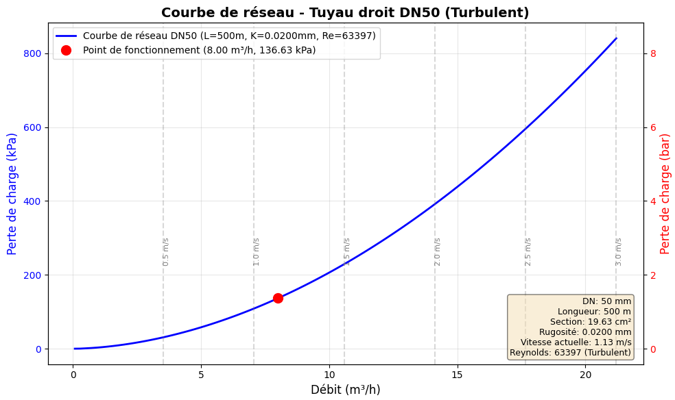

===========
Usage Guide
===========

This comprehensive guide presents the main features of **EnergySystemModels** with detailed examples and illustrations.

.. contents:: Table of Contents
   :local:
   :depth: 3

----

.. _installation:

Installation
============

Standard Installation
---------------------

To use EnergySystemModels, first install it via pip:

.. code-block:: console

   pip install energysystemmodels

Virtual Environment Installation
---------------------------------

.. code-block:: console

   # Create a virtual environment
   python -m venv .venv
   
   # Activate the environment (Windows)
   .venv\Scripts\activate
   
   # Activate the environment (Linux/Mac)
   source .venv/bin/activate
   
   # Install the library
   pip install energysystemmodels

Update
------

To update EnergySystemModels to the latest version:

.. code-block:: console

   pip install --upgrade energysystemmodels

----

.. _thermodynamiccycles:

1. Thermodynamic Cycles
========================

The **ThermodynamicCycles** package provides components to model complete thermodynamic cycles: sources, sinks, compressors, evaporators, condensers, expansion valves, pumps, heat exchangers, etc.

1.1. Fluid Source
------------------

The ``Source`` class represents a fluid source with defined thermodynamic properties.

.. code-block:: python
   :linenos:

   from ThermodynamicCycles.Source import Source

   # Create a Source object
   SOURCE = Source.Object()
   
   # Input data
   SOURCE.Ti_degC = 25
   SOURCE.Pi_bar = 1.01325
   SOURCE.fluid = "air"
   SOURCE.F_Sm3h = 3600  # Standard volumetric flow rate [Sm³/h]
   
   # Calculate the object
   SOURCE.calculate()
   
   # Display results
   print(SOURCE.df)

**Results** ::

      F[Sm³/h]  F[kg/s]    T[°C]  P[bar]     h[J/kg]        s[J/(kg·K)]   ρ[kg/m³]
  0   3600.0     1.184     25.0   1.013    298150.0       6870.3          1.184

.. seealso::
   For more details, see :doc:`002-thermodynamic_cycles/fluid_source`

1.2. Sink
---------

The ``Sink`` class represents a fluid sink (system outlet).

.. code-block:: python
   :linenos:

   from ThermodynamicCycles.Sink import Sink
   from ThermodynamicCycles.Connect import Fluid_connect

   # Create the sink
   SINK = Sink.Object()
   
   # Connect to previous component
   Fluid_connect(SINK.Inlet, SOURCE.Outlet)
   
   # Calculate
   SINK.calculate()
   print(SINK.df)

.. seealso::
   For more details, see :doc:`002-thermodynamic_cycles/sink`

1.3. Compressor
---------------

The ``Compressor`` class models a compressor with different models (isentropic, volumetric).

.. code-block:: python
   :linenos:

   from ThermodynamicCycles.Compressor import Compressor
   from ThermodynamicCycles.Connect import Fluid_connect

   # Create the compressor
   COMP = Compressor.Object()
   COMP.Po_bar = 8.0  # Outlet pressure [bar]
   COMP.eta_is = 0.75  # Isentropic efficiency
   
   # Connect to previous component
   Fluid_connect(COMP.Inlet, SOURCE.Outlet)
   
   # Calculate
   COMP.calculate()
   
   # Results
   print(f"Power consumption: {COMP.W_kW:.2f} kW")
   print(f"Outlet temperature: {COMP.To_degC:.1f} °C")
   print(COMP.df)

.. seealso::
   For more details, see :doc:`002-thermodynamic_cycles/compressor`

----

.. _heattransfer:

2. Heat Transfer
=================

Convective and Radiative Heat Transfer
---------------------------------------

The image below shows an example of convective and radiative heat transfer through an uninsulated plate heat exchanger with a wall temperature of 60°C and an ambient temperature of 25°C:

.. image:: images/PlateHeatTransfer.png
   :alt: Plate Heat Transfer
   :width: 300px
   :align: center

.. code-block:: python
   :linenos:

   from HeatTransfer import PlateHeatTransfer

   # Wall temperature in °C
   Tp = 60
   # Ambient temperature in °C
   Ta = 25
   # Dimensions in meters
   L = 0.6
   W = 0.8
   H = 1.5

   # Calculate heat transfer for top horizontal plate
   top = PlateHeatTransfer.Object(
       orientation='horizontal_up',
       Tp=Tp, Ta=Ta, W=W, L=L
   ).calculate()

   # Calculate heat transfer for bottom horizontal plate
   bottom = PlateHeatTransfer.Object(
       orientation='horizontal_down',
       Tp=Tp, Ta=Ta, W=W, L=L
   ).calculate()

   # Calculate heat transfer for vertical plates
   vertical1 = PlateHeatTransfer.Object(
       orientation='vertical',
       Tp=Tp, Ta=Ta, W=W, H=H
   ).calculate() * 2

   vertical2 = PlateHeatTransfer.Object(
       orientation='vertical',
       Tp=Tp, Ta=Ta, W=L, H=H
   ).calculate() * 2

   # Calculate total heat transfer
   total = top + bottom + vertical1 + vertical2
   print(f"{round(total, 0)} W = {round(top, 0)} W + {round(bottom, 0)} W + {round(vertical1, 0)} W + {round(vertical2, 0)} W")

**Result** ::

   1957.0 W = 191.0 W + 190.0 W + 900.0 W + 675.0 W

2.1. Composite Wall
-------------------

Calculation of thermal losses through a multilayer composite wall:

.. image:: images/001_heat_transfer_composite_wall.png
   :alt: Composite Wall
   :width: 500px
   :align: center

.. code-block:: python
   :linenos:

   from HeatTransfer import CompositeWall

   # Create a composite wall
   wall = CompositeWall.Object(he=23, hi=8, Ti=20, Te=-10, A=10)
   
   # Calculate the transfer
   wall.calculate()
   
   # Display results
   print(f"Total resistance: {wall.R_total:.3f} m².K/W")
   print(f"Heat flux: {wall.Q:.2f} W")
   print(wall.df)

.. seealso::
   For more details with illustrations, see :doc:`001-heat_transfer/composite_wall_heat_transfer`

Second Example: Thermodynamic Cycle
------------------------------------

Creating a refrigerant fluid source:

.. code-block:: python
   :linenos:

   from ThermodynamicCycles.Source import Source

   # Create a Source object
   SOURCE = Source.Object()
   
   # Input data
   SOURCE.Ti_degC = 25
   SOURCE.Pi_bar = 1.01325
   SOURCE.fluid = "air"
   SOURCE.F_Sm3h = 3600  # Standard volumetric flow rate [Sm³/h]
   
   # Calculate the object
   SOURCE.calculate()
   
   # Display results
   print(SOURCE.df)

Third Example: Fresh Air AHU
-----------------------------

Complete air handling unit simulation:

.. code-block:: python
   :linenos:

   from AHU import FreshAir, HeatingCoil
   from AHU.Humidification import Humidifier
   from AHU.Connect import Air_connect
   from AHU.air_humide import PsychrometricChart

   # Fresh air
   AN = FreshAir.Object()
   AN.F_m3h = 3000
   AN.T = 5
   AN.RH = 80
   AN.calculate()

   # Heating coil
   BC = HeatingCoil.Object()
   BC.To_target = 20
   Air_connect(BC.Inlet, AN.Outlet)
   BC.calculate()

   # Humidifier
   HMD = Humidifier.Object()
   HMD.wo_target = 8
   Air_connect(HMD.Inlet, BC.Outlet)
   HMD.HumidType = "vapeur"
   HMD.calculate()

   # Psychrometric chart
   chart = PsychrometricChart.Object(figsize=(12, 4))
   chart.set_title('AHU Heating Coil & Steam Humidifier')
   
   custom_points = [
       {'h': BC.Inlet.h, 'w': BC.Inlet.w},
       {'h': BC.Outlet.h, 'w': BC.Outlet.w},
       {'h': HMD.Outlet.h, 'w': HMD.Outlet.w}
   ]
   chart.add_points(custom_points)
   chart.show(draw_arrows=True)

.. seealso::
   For more details with illustrations, see :doc:`003-ahu_modules/cta_air_neuf`

Fourth Example: Pinch Analysis
-------------------------------

Thermal integration optimization:

.. code-block:: python
   :linenos:

   import pandas as pd
   from PinchAnalysis import PinchAnalysis

   # Define thermal streams
   df = pd.DataFrame({
       'Ti': [200, 125, 50, 45],      # Initial temperatures [°C]
       'To': [50, 45, 250, 195],      # Final temperatures [°C]
       'mCp': [3.0, 2.5, 2.0, 4.0],   # Capacity flow rate [kW/K]
       'dTmin2': [5, 5, 5, 5],        # ΔTmin/2 [K]
       'integration': [True, True, True, True]
   })

   # Analyze
   pinch = PinchAnalysis.Object(df)
   
   # Results
   print(f"Pinch Point: {pinch.T_pinch}°C")
   print(f"Minimum hot utility: {pinch.Qh_min} kW")
   print(f"Minimum cold utility: {pinch.Qc_min} kW")
   
   # Visualize
   pinch.plot_composites_curves()
   pinch.plot_GCC()

----

.. _hydraulic:

3. Hydraulics
=============

3.1. Linear Pressure Losses
----------------------------

Calculation according to Darcy-Weisbach with network curve:

.. image:: images/004_hydraulic_straight_pipe.png
   :alt: Straight Pipe
   :width: 500px
   :align: center

.. code-block:: python
   :linenos:

   from Hydraulic import StraightPipe

   # Create the pipe
   pipe = StraightPipe.Object()
   pipe.L = 100  # Length [m]
   pipe.DN = 50  # Nominal diameter [mm]
   pipe.material = 'Steel'
   pipe.F_m3h = 10  # Flow rate [m³/h]
   
   # Calculate
   pipe.calculate()
   
   # Results
   print(f"Pressure loss: {pipe.dP_Pa:.1f} Pa")
   print(f"Velocity: {pipe.v:.2f} m/s")
   print(f"Friction coefficient: {pipe.f:.4f}")
   
   # Plot network curve
   pipe.plot_network_curve(F_min=0, F_max=20, points=50)

**Network curve** :

.. seealso::
   For more details, see :doc:`004-hydraulic/perte_pression_lineaire`

3.2. IMI TA Balancing Valves
-----------------------------

Calculation with Kv interpolation for 120+ references:

.. image:: images/004_TA_valve.png
   :alt: TA Valve
   :width: 500px
   :align: center

.. code-block:: python
   :linenos:

   from Hydraulic.TA_Valve import TA_Valve

   # Create the valve
   valve = TA_Valve.Object()
   valve.reference = "TA-FUSION-C DN32"
   valve.opening = 3.5  # Opening turns
   valve.F_m3h = 5  # Flow rate [m³/h]
   valve.rho = 1000  # Density [kg/m³]
   
   # Calculate
   valve.calculate()
   
   # Results
   print(f"Interpolated Kv: {valve.Kv:.2f}")
   print(f"Pressure loss: {valve.dP_kPa:.1f} kPa")
   print(f"Authority: {valve.authority:.2f}")
   
   # Plot network curve
   valve.plot_network_curve()

**Valve network curve** :

.. image:: images/004_TA_valve-courbe-reseau.png
   :alt: TA Valve Network Curve
   :width: 600px
   :align: center

.. seealso::
   For more details, see :doc:`004-hydraulic/TA_valve`

----

.. _meteo:

4. Weather Data
===============

4.1. OpenWeatherMap
-------------------

Real-time weather data retrieval via API:

.. code-block:: python
   :linenos:

   from OpenWeatherMap.OpenWeatherMap import WeatherData

   # Initialize with your API key
   weather = WeatherData(api_key="YOUR_API_KEY")
   
   # Get data for a city
   data = weather.get_current_weather(city="Paris")
   
   print(f"Temperature: {data['temperature']}°C")
   print(f"Humidity: {data['humidity']}%")
   print(f"Description: {data['description']}")
   print(f"Wind speed: {data['wind_speed']} m/s")
   print(f"Pressure: {data['pressure']} hPa")

**Historical weather** :

.. code-block:: python
   :linenos:

   # Historical data
   hist_data = weather.get_historical_weather(
       city="Paris",
       start_date="2023-01-01",
       end_date="2023-01-31"
   )
   
   # Save to DataFrame
   import pandas as pd
   df = pd.DataFrame(hist_data)
   df.to_excel("historical_weather_paris.xlsx")

.. seealso::
   For more details, see :doc:`008-meteo/openweathermap`

4.2. MeteoCiel
--------------

Historical data scraping with automatic degree-day calculation:

.. code-block:: python
   :linenos:

   from MeteoCiel.MeteoCiel import MeteoCiel_histoScraping
   from datetime import datetime

   # Station code (example: Orly 07149001)
   code2 = "07149001"
   
   # Period
   date_debut = datetime(2022, 1, 1)
   date_fin = datetime(2022, 12, 31)
   
   # Scraping with HDD calculation
   df_histo, df_day, df_month, df_year = MeteoCiel_histoScraping(
       code2, 
       date_debut, 
       date_fin,
       base_chauffage=18,
       base_refroidissement=23
   )
   
   # Save results
   df_histo.to_excel(f"Meteociel_hourly_{date_debut.date()}_to_{date_fin.date()}.xlsx")
   df_day.to_excel(f"Meteociel_daily_{date_debut.date()}_to_{date_fin.date()}.xlsx")
   df_month.to_excel(f"Meteociel_monthly_{date_debut.date()}_to_{date_fin.date()}.xlsx")
   df_year.to_excel(f"Meteociel_yearly_{date_debut.date()}_to_{date_fin.date()}.xlsx")
   
   # Display monthly HDD
   print(df_month[['Month', 'HDD_heating', 'HDD_cooling', 'T_avg']])

**Results** ::

        Month  HDD_heating  HDD_cooling   T_avg
   0  2022-01       385.2          0.0     5.2
   1  2022-02       320.5          0.0     7.1
   2  2022-03       245.8          0.0    10.5
   ...

.. seealso::
   For more details, see :doc:`008-meteo/meteociel`

----

.. _ipmvp:

5. IPMVP (Measurement and Verification)
========================================

International Performance Measurement and Verification Protocol
----------------------------------------------------------------

IPMVP allows quantifying energy savings achieved by energy efficiency projects.

.. code-block:: python
   :linenos:

   from IPMVP.IPMVP import Mathematical_Models
   import pandas as pd
   from datetime import datetime

   # Load data
   df = pd.read_excel("Input-Data.xlsx")
   df['Timestamp'] = pd.to_datetime(df['Timestamp'])
   df = df.set_index('Timestamp')
   
   # Define periods
   start_baseline_period = datetime(2018, 1, 1)
   end_baseline_period = datetime(2021, 12, 31)
   start_reporting_period = datetime(2022, 1, 1)
   end_reporting_period = datetime(2023, 3, 1)
   
   # Aggregate by day
   df_daily = df.resample('D').sum()
   X = df_daily[["x1", "x2", "x3", "x4", "x5", "x6"]]  # Independent variables
   y = df_daily["y"]  # Energy consumption
   
   # Daily IPMVP model with polynomial regression
   day_model = Mathematical_Models(
       y, X,
       start_baseline_period, end_baseline_period,
       start_reporting_period, end_reporting_period,
       degree=3,  # Polynomial degree
       print_report=True,
       seuil_z_scores=3  # Outlier detection
   )
   
   # Results
   print(f"Energy savings: {day_model.savings_kWh:.0f} kWh")
   print(f"Relative savings: {day_model.savings_percent:.1f}%")
   print(f"Model R²: {day_model.r2:.3f}")
   print(f"RMSE: {day_model.rmse:.2f}")
   print(f"Uncertainty (95%): {day_model.uncertainty_percent:.1f}%")

**Weekly model** :

.. code-block:: python
   :linenos:

   # Aggregate by week
   weekly_X = X.resample('W').sum()
   weekly_y = y.resample('W').sum()
   
   week_model = Mathematical_Models(
       weekly_y, weekly_X,
       start_baseline_period, end_baseline_period,
       start_reporting_period, end_reporting_period
   )
   
   print(f"Weekly savings: {week_model.savings_kWh:.0f} kWh")

**Monthly model** :

.. code-block:: python
   :linenos:

   # Aggregate by month
   monthly_X = X.resample('M').sum()
   monthly_y = y.resample('M').sum()
   
   month_model = Mathematical_Models(
       monthly_y, monthly_X,
       start_baseline_period, end_baseline_period,
       start_reporting_period, end_reporting_period
   )
   
   print(f"Monthly savings: {month_model.savings_kWh:.0f} kWh")

.. seealso::
   For more details, see :doc:`007-ipmvp/index`

----

.. _pv:

6. Solar Photovoltaic Production
=================================

PV production simulation with pvlib
------------------------------------

.. code-block:: python
   :linenos:

   from PV.ProductionElectriquePV import SolarSystem

   # Create the solar system
   system = SolarSystem(
       latitude=48.8566,
       longitude=2.3522,
       location_name='Paris',
       tilt=34,  # Tilt angle [°]
       timezone='Etc/GMT-1',
       azimuth=180.0,  # South orientation
       system_capacity=48.9  # Peak power [kWp]
   )
   
   # Retrieve module and inverter data
   system.retrieve_module_inverter_data()
   
   # Retrieve weather data (PVGIS or local file)
   system.retrieve_weather_data()
   
   # Calculate solar parameters
   system.calculate_solar_parameters()
   
   # Visualize annual production
   system.plot_annual_energy()
   
   # Results
   print(f"Annual production: {system.annual_energy:.0f} kWh")
   print(f"Specific yield: {system.specific_yield:.0f} kWh/kWp")
   print(f"Performance ratio: {system.performance_ratio:.2f}")
   print(f"Capacity factor: {system.capacity_factor:.2f}%")

**Monthly production** :

.. code-block:: python
   :linenos:

   # Production by month
   monthly_production = system.get_monthly_production()
   print(monthly_production)
   
   # Monthly production graph
   system.plot_monthly_production()

**Hourly production** :

.. code-block:: python
   :linenos:

   # Hourly production profile for a typical day
   system.plot_daily_profile(month=6, day=21)  # June 21 (summer solstice)

.. seealso::
   For more details, see :doc:`009-pv-solaire/index`

----

.. _turpe:

7. TURPE Calculation
====================

Tariff for the Use of Public Electricity Networks
--------------------------------------------------

TURPE covers the costs of electricity transmission on public transmission and distribution networks.

.. code-block:: python
   :linenos:

   from Facture.TURPE import input_Contrat, TurpeCalculator, input_Facture, input_Tarif

   # Invoice data (period and consumption)
   facture = input_Facture(
       start="2022-09-01",
       end="2022-09-30",
       heures_depassement=0,
       depassement_PS_HPB=64,
       kWh_pointe=0,
       kWh_HPH=0,
       kWh_HCH=0,
       kWh_HPB=26635,  # Peak Low Hours
       kWh_HCB=12846   # Off-peak Low Hours
   )
   
   # Contract data
   contrat = input_Contrat(
       domaine_tension="BT > 36 kVA",  # Low Voltage
       PS_pointe=129,   # Subscribed power Peak [kVA]
       PS_HPH=129,      # Subscribed power HPH [kVA]
       PS_HCH=129,      # Subscribed power HCH [kVA]
       PS_HPB=129,      # Subscribed power HPB [kVA]
       PS_HCB=250,      # Subscribed power HCB [kVA]
       version_utilisation="LU",  # Long Use
       pourcentage_ENR=100  # % renewable energy
   )
   
   # Tariff data (energy prices)
   tarif = input_Tarif(
       c_euro_kWh_pointe=0.2,
       c_euro_kWh_HPH=0.18,
       c_euro_kWh_HCH=0.12,
       c_euro_kWh_HPB=0.15,
       c_euro_kWh_HCB=0.10
   )
   
   # Calculate TURPE
   calculator = TurpeCalculator(facture, contrat, tarif)
   results = calculator.calculate()
   
   # Detailed results
   print(f"Annual management component: {results['CG_annuelle']:.2f} €")
   print(f"Annual metering component: {results['CC_annuelle']:.2f} €")
   print(f"Withdrawal component: {results['CS_totale']:.2f} €")
   print(f"Monthly TURPE total: {results['TURPE_mensuel']:.2f} €")
   print(f"Annual TURPE total: {results['TURPE_annuel']:.2f} €")

**Calculation for HV (High Voltage)** :

.. code-block:: python
   :linenos:

   # HV contract
   contrat_hta = input_Contrat(
       domaine_tension="HTA",
       PS_pointe=500,
       PS_HPH=500,
       PS_HCH=500,
       PS_HPB=500,
       PS_HCB=800,
       version_utilisation="MU"  # Medium Use
   )
   
   calculator_hta = TurpeCalculator(facture, contrat_hta, tarif)
   results_hta = calculator_hta.calculate()

.. seealso::
   For more details, see :doc:`010-achat-energie/index`

----

.. _cee:

8. Energy Savings Certificates (CEE)
=====================================

CEE calculation for different standardized schemes
---------------------------------------------------

CEE is a mechanism that requires energy suppliers to achieve energy savings.

.. code-block:: python
   :linenos:

   from CEE import CEECertificate

   # Create a CEE certificate
   cee = CEECertificate()
   
   # Scheme BAT-TH-116: Attic or roof insulation
   cee.fiche = "BAT-TH-116"
   cee.surface = 150  # Insulated area [m²]
   cee.zone_climatique = "H1"  # Climate zone
   cee.resistance_thermique = 7.0  # Thermal resistance [m².K/W]
   cee.type_batiment = "Single-family house"
   
   # Calculate
   cee.calculate()
   
   # Results
   print(f"Energy savings: {cee.economie_kWh_an:.0f} kWh/year")
   print(f"CEE amount: {cee.montant_cee:.0f} cumac kWh")
   print(f"Lifetime: {cee.duree_vie} years")
   print(f"Estimated financial value: {cee.valeur_euro:.2f} €")

**Scheme BAT-TH-104: Condensing boiler** :

.. code-block:: python
   :linenos:

   cee_chaudiere = CEECertificate()
   cee_chaudiere.fiche = "BAT-TH-104"
   cee_chaudiere.puissance_nominale = 24  # Power [kW]
   cee_chaudiere.zone_climatique = "H1"
   cee_chaudiere.type_batiment = "Collective residential"
   cee_chaudiere.efficacite_energetique_saisonniere = 92  # ETAS [%]
   
   cee_chaudiere.calculate()
   
   print(f"Boiler CEE: {cee_chaudiere.montant_cee:.0f} cumac kWh")

**Scheme IND-UT-117: Electronic variable speed drive system** :

.. code-block:: python
   :linenos:

   cee_variateur = CEECertificate()
   cee_variateur.fiche = "IND-UT-117"
   cee_variateur.puissance_moteur = 15  # Power [kW]
   cee_variateur.duree_fonctionnement = 4000  # Hours/year
   cee_variateur.taux_charge_moyen = 75  # %
   
   cee_variateur.calculate()
   
   print(f"Drive CEE: {cee_variateur.montant_cee:.0f} cumac kWh")

**CEE market price** :

.. code-block:: python
   :linenos:

   # Financial valuation
   prix_cee_classique = 0.006  # €/cumac kWh (variable according to market)
   prix_cee_precarite = 0.012  # €/cumac kWh (energy poverty)
   
   valorisation_classique = cee.montant_cee * prix_cee_classique
   valorisation_precarite = cee.montant_cee * prix_cee_precarite
   
   print(f"Classic valuation: {valorisation_classique:.2f} €")
   print(f"Poverty valuation: {valorisation_precarite:.2f} €")

.. seealso::
   For more details, see :doc:`011-cee/index`

----

Detailed Modules with Illustrations
====================================

Heat Transfer
-------------

**Complete articles with diagrams and examples** :

.. toctree::
   :maxdepth: 1

   001-heat_transfer/composite_wall_heat_transfer
   001-heat_transfer/pipe_insulation_analysis
   001-heat_transfer/corps_parallelepipedique

Thermodynamic Cycles
--------------------

**Complete articles with diagrams** :

.. toctree::
   :maxdepth: 1

   002-thermodynamic_cycles/index

Air Handling Units (AHU)
-------------------------

**Complete articles with illustrations** :

.. toctree::
   :maxdepth: 1

   003-ahu_modules/cta_air_neuf
   003-ahu_modules/generic_ahu

Hydraulics
----------

**Complete articles with network curves** :

.. toctree::
   :maxdepth: 1

   004-hydraulic/perte_pression_lineaire
   004-hydraulic/TA_valve

Pinch Analysis
--------------

**Complete articles with diagrams** :

.. toctree::
   :maxdepth: 1

   006-pinch_analysis/index

----

Advanced Concepts
=================

Error Handling
--------------

EnergySystemModels automatically handles calculation errors:

.. code-block:: python
   :linenos:

   from HeatTransfer import CompositeWall

   try:
       wall = CompositeWall.Object(he=23, hi=8, Ti=20, Te=-10, A=10)
       wall.add_layer(thickness=0.20, material='Hollow blocks')
       wall.calculate()
   except ValueError as e:
       print(f"Value error: {e}")
   except Exception as e:
       print(f"General error: {e}")

Component Connection
--------------------

For complex systems, use connectors:

.. code-block:: python
   :linenos:

   from AHU import FreshAir, HeatingCoil
   from AHU.Connect import Air_connect

   # Component 1
   FA = FreshAir.Object()
   FA.RH = 50
   FA.T = 20
   FA.F_m3h = 3000
   FA.calculate()
   
   # Component 2 connected to the first
   BC = HeatingCoil.Object()
   Air_connect(BC.Inlet, FA.Outlet)  # Connection
   BC.To_target = 25
   BC.calculate()

.. important::
   Automatic connection transfers temperature, humidity, flow rate, and enthalpy

Results Access
--------------

**Method 1: Direct attributes**

.. code-block:: python

   print(wall.R_total)  # Total resistance
   print(wall.Q)        # Heat flux
   print(wall.layers)   # Layer list

**Method 2: Pandas DataFrame**

.. code-block:: python

   # Display everything
   print(wall.df)
   
   # Specific access
   print(wall.df['Resistance (m².°C/W)'])
   
   # Excel export
   wall.df.to_excel('results.xlsx', index=False)
   
   # CSV export
   wall.df.to_csv('results.csv', index=False)

Results Visualization
---------------------

**Psychrometric charts**

.. code-block:: python
   :linenos:

   from AHU.air_humide import PsychrometricChart

   chart = PsychrometricChart.Object(figsize=(12, 8))
   chart.set_title('Air evolution in the AHU')
   
   # Add points
   points = [
       {'h': 15.8, 'w': 4.3},
       {'h': 20.5, 'w': 4.3},
       {'h': 22.1, 'w': 8.0}
   ]
   chart.add_points(points)
   chart.show(draw_arrows=True)

**Pinch curves**

.. code-block:: python
   :linenos:

   from PinchAnalysis import PinchAnalysis

   pinch = PinchAnalysis.Object(dataframe)
   
   # Composite curves
   pinch.plot_composites_curves()
   
   # Grand composite curve
   pinch.plot_GCC()
   
   # Save figures
   pinch.plot_composites_curves(save_path='composite_curves.png')

**Hydraulic curves**

.. code-block:: python
   :linenos:

   from Hydraulic import StraightPipe

   pipe = StraightPipe.Object()
   pipe.L = 100
   pipe.DN = 50
   pipe.material = 'Steel'
   
   # Generate network curve
   pipe.plot_network_curve(F_min=0, F_max=10, points=50)

----

Imports and Dependencies
========================

Main Imports
------------

Here are the most commonly used imports:

.. code-block:: python

   # Heat transfer
   from HeatTransfer import CompositeWall, PipeInsulation

   # Thermodynamic cycles
   from ThermodynamicCycles.Source import Source
   from ThermodynamicCycles.Sink import Sink
   from ThermodynamicCycles.Compressor import Compressor
   from ThermodynamicCycles.HEX import HEX

   # Hydraulics
   from Hydraulic import StraightPipe
   from Hydraulic.TA_Valve import TA_Valve

   # AHU
   from AHU import FreshAir, HeatingCoil, CoolingCoil
   from AHU.Humidification import Humidifier
   from AHU.Connect import Air_connect

   # Energy analysis
   from PinchAnalysis import PinchAnalysis
   from IPMVP.IPMVP import IPMVP

   # Weather data
   from OpenWeatherMap.OpenWeatherMap import WeatherData
   from MeteoCiel.MeteoCiel import MeteoCiel
   
   # Solar production
   from PV import PVSystem
   
   # Billing
   from Facture import TURPECalculator
   from CEE import CEECertificate

Dependencies
------------

EnergySystemModels requires the following libraries:

.. code-block:: text

   numpy>=1.20.0
   pandas>=1.3.0
   matplotlib>=3.4.0
   CoolProp>=6.4.0
   scipy>=1.7.0

These dependencies are automatically installed with pip.

Configuration
-------------

**Environment variables for weather APIs** :

.. code-block:: bash

   # Windows
   set OPENWEATHERMAP_API_KEY=your_api_key
   
   # Linux/Mac
   export OPENWEATHERMAP_API_KEY=your_api_key

**Python configuration** :

.. code-block:: python

   import os
   os.environ['OPENWEATHERMAP_API_KEY'] = 'your_api_key'

----

Units and Conventions
=====================

Unit System
-----------

All inputs and outputs use the International System (SI) with these default units:

.. list-table::
   :widths: 40 30 30
   :header-rows: 1

   * - Physical Quantity
     - Unit
     - Symbol
   * - Temperature
     - Degree Celsius
     - °C
   * - Pressure
     - Bar
     - bar
   * - Mass Flow Rate
     - Kilogram per second
     - kg/s
   * - Volumetric Flow Rate
     - Cubic meter per hour
     - m³/h
   * - Power
     - Kilowatt
     - kW
   * - Energy
     - Kilowatt-hour
     - kWh
   * - Length
     - Meter
     - m
   * - Area
     - Square meter
     - m²
   * - Thermal Conductivity
     - Watt per meter-kelvin
     - W/(m·K)
   * - Thermal Resistance
     - Square meter-kelvin per watt
     - m²·K/W

.. warning::
   Do not mix units (e.g., °C and K, or bar and Pa) in calculations

Naming Conventions
------------------

**Object attributes** :

- ``T`` or ``Ti``: Temperature in °C
- ``P`` or ``Pi``: Pressure in bar
- ``F``: Flow rate (specify ``F_kg_s`` or ``F_m3h``)
- ``RH``: Relative humidity in %
- ``w``: Absolute humidity in g/kg_dry_air
- ``h``: Enthalpy in kJ/kg
- ``Q``: Thermal power in kW
- ``df``: Pandas DataFrame with all results

----

Additional Resources
====================

Complete Documentation
----------------------

.. hlist::
   :columns: 2

   * :doc:`quickstart` - Quick Start Guide
   * :doc:`api` - Detailed API Reference
   * :doc:`001-heat_transfer/index` - Heat Transfer
   * :doc:`002-thermodynamic_cycles/index` - Thermodynamic Cycles
   * :doc:`003-ahu_modules/index` - Air Handling Units
   * :doc:`004-hydraulic/index` - Hydraulics
   * :doc:`006-pinch_analysis/index` - Pinch Analysis
   * :doc:`gui_tools` - Graphical Tools

Useful Links
------------

.. list-table::
   :widths: 30 70
   :header-rows: 1

   * - Resource
     - Link
   * - 📚 Online Documentation
     - https://energysystemmodels-en.readthedocs.io/
   * - 💻 Source Code
     - https://github.com/ZoheirHADID/EnergySystemModels
   * - 📦 PyPI
     - https://pypi.org/project/energysystemmodels/
   * - 🐛 Issues and Support
     - https://github.com/ZoheirHADID/EnergySystemModels/issues
   * - 📖 Handbook PDF
     - https://github.com/ZoheirHADID/EnergySystemModels-handbook
